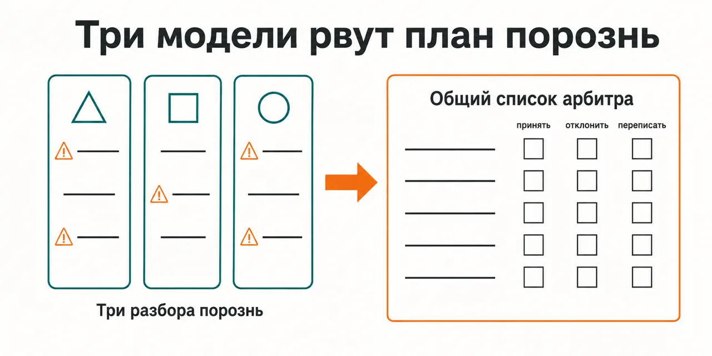
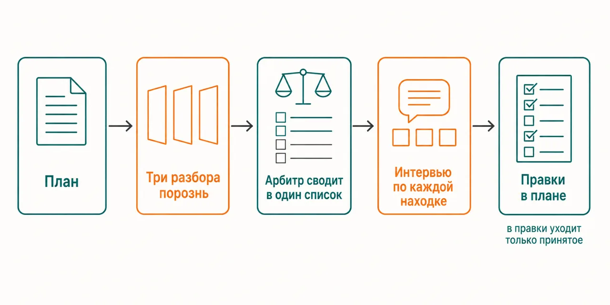

English · [Русский](README.md)

# Your plan gets checked by the person who wrote it — and by the same model that wrote it

Three models tear into it separately, none of them seeing the others' answers, and an arbiter merges
the findings into one list — before you have put anything into the plan.

```
claude plugin marketplace add https://github.com/beCyborg/jadlis-hub
claude plugin install jadlis-verif@jadlis
```

No keys needed — this is the only one in the line that does not need Brave and Firecrawl. What it
does need is one subscription of your own: ChatGPT — for Codex CLI; a Grok subscription is optional.



In words: three separate readings of the same plan on the left and the arbiter's common list on the
right, where every finding carries an "accept / reject / rewrite" fork.

This is my workbench published as it is, not a product: whatever I stopped using, I removed.

## Before → after

| By hand | With an AI chat | With this plugin |
|---|---|---|
| **Who looks for the hole.** The plan is re-read by whoever wrote it — and finds typos instead of holes. | It is checked by the same model that wrote the plan. | Codex, Fable and Grok read the plan separately and do not see each other's answers. |
| **Whose frame the reviewer uses.** One head, one angle. | Your own frame, retold back to you: whatever you did not ask about is not there. | The three frames differ — so you also see what you never asked about. |
| **What to do with a heap of findings.** The list sits in your notes and goes stale. | You get one more long list, and half of the edits you roll back later. | The arbiter merges the findings into one list: what several found weighs more than what one wrote beautifully. |
| **How a finding becomes an edit.** By hand, if you ever get round to it. | Discussed and forgotten. | A batch interview over every finding: accept, reject or rewrite — and only then the edits. |
| **When the hole opens up.** During execution, when the money and the month are already in. | Same place. | Before. |

## How it works



Going in — your plan as a single file.
Inside — Codex, Fable and Grok take it apart in parallel and do not see each other's answers; the
arbiter merges the findings into one list and raises whatever the readings agreed on.
Coming out — a batch interview over every finding: accept, reject or rewrite, and only what you
accepted goes into the edits.

In words: the plan → three readings separately → the arbiter merges them into one list → an interview
over every finding → edits in the plan.

<details>
<summary>If people did this · How it differs from Perplexity, ChatGPT Deep Research and Grok · An example</summary>

### If people did this

| Role | How many people | What the plugin does here |
|---|---|---|
| Independent reviewer | three, each with their own frame, seated in separate rooms | takes the plan apart with three models separately, with each one's answers hidden from the others |
| Arbiter | a separate person who merges the three readings and removes duplicates | collects the findings into one list and raises what several agreed on |
| Review facilitator | a separate person who walks the list with you and records the decision | a batch interview: accept, reject or rewrite on every finding |
| Editor | a separate person who puts what was accepted into the document | makes the edits after your decisions |

Nothing is said about money here, deliberately: I have not collected sources on what this kind of
work costs.

### How it differs from Perplexity, ChatGPT Deep Research and Grok

A comparison of mechanisms only — not of who deserves your trust.

| Mechanism | This plugin | Perplexity | ChatGPT Deep Research | Grok |
|---|---|---|---|---|
| Do several models take the text apart separately, without seeing each other's answers | yes, three models | yes, in Model Council mode: three models in parallel | not documented | no: the documentation describes a discussion between agents |
| Are the divergences between the readings merged into one list | yes, by an arbiter | yes, a separate synthesiser model in Model Council | not documented | partly: a lead agent merges them, there is no list of divergences |
| Is what is disputed marked apart from what was agreed | yes, agreed and single-voice findings are kept apart | yes, it shows where the models converged and where they diverged | not documented | not documented |
| Does a list of findings with your decision on each one survive | yes, after the batch interview | partly: findings along the way, no decision on them | partly: the plan is edited before the run, not the findings | not documented |
| Are primary sources checked on the web | switched on if `jadlis-search` is installed | yes | yes | yes |

The plugin column was checked on 2026-09-07. The three other columns were assembled the same day
from official documentation: [Model Council](https://www.perplexity.ai/hub/blog/introducing-model-council)
and [the Perplexity help centre](https://www.perplexity.ai/help-center/en/articles/13600190-what-s-new-in-advanced-deep-research),
[the OpenAI Deep Research help page](https://help.openai.com/en/articles/10500283-deep-research-faq),
[docs.x.ai](https://docs.x.ai/developers/model-capabilities/text/multi-agent). "Not documented" means
exactly that, and not "no". Grok has "no" in the first row because the documentation describes
directly that the agents discuss the task with each other. The first three Perplexity rows are about
Model Council mode, not about Deep Research: on its own it claims no multi-model review with an
arbiter. Grok's multi-agent mode is in beta and only through the API.

### An example

You have a renovation plan: the order of the works, what you do yourself, where you economise, when
you move in. Three models read it separately. Codex picks at the order of the works: the screed and
its drying time come earlier than the delivery assumes. Fable finds something else: there is no
acceptance check after a stage anywhere in the plan, and the rework will surface at the end. Grok
asks about what is not in the plan at all — what happens if the contractor disappears for a week. The
arbiter merges this into one list and shows where two of them landed on the same thing. You walk the
list and on every finding you say: accept, reject, rewrite. Only what was accepted goes into the plan
— before the materials arrive.

</details>

## Installing and the first run

**a) Text to paste to an agent.** Copy the whole thing into a Claude Code chat:

```
You are the installer. Install the plugin jadlis-verif from the jadlis marketplace on this Mac.
First check that Claude Code is installed and the subscription is active, and that Codex CLI and
Grok CLI are on the machine. Tell me "present" or "absent" for each — never print tokens or the
contents of config files.
If Codex CLI is missing — stop and tell me: it does not work without it. If Grok CLI is
missing — carry on: the review runs in dual mode, Codex and Fable.
Then run exactly these commands, verbatim, shortening nothing:
1. claude plugin marketplace add https://github.com/beCyborg/jadlis-hub
2. claude plugin install jadlis-verif@jadlis
3. claude plugin list — show me the line about jadlis-verif and its version.
Do not ask me for API keys: this plugin does not need them, and write no keys into any config.
Before each command show it to me in full and wait for "yes". If I say "no", do not run it.
If a command returns an error, stop, show me the output, and do not move to the next one.
```

**b) Commands by hand.**

```
claude plugin marketplace add https://github.com/beCyborg/jadlis-hub
claude plugin install jadlis-verif@jadlis
claude plugin list
```

The first command installs nothing — it adds the marketplace. Only the second one installs, and one
line removes it: `claude plugin uninstall jadlis-verif@jadlis --keep-data`.

**c) The short command.** Open Claude Code in the folder where the plan lives and type:

```
/verif <path to the file with the plan>
```

If it is not found, check the name with `claude plugin list`. Make the first review a plan you have
not put anything into yet: the point is for the hole to open up before the money, not after.

## Limits, cost, updating

**What it does not do.** It does not write the plan for you — it only tears into the one written. It
does not make the decisions on the findings: accept, reject or rewrite is yours to say, and only what
was accepted goes into the edits. It does not check primary sources on the web by itself: the web
check switches on additionally if you have `jadlis-search` installed. And the main thing: three readings
agreeing is three readings agreeing, not proof. The arbiter shows where two of them converged and
where one voice was left against two; the decision is still yours.

**What you need.** No keys — this is the only one in the line that does not need Brave and Firecrawl.
What it does need is one subscription of your own: ChatGPT — for Codex CLI. A Grok subscription is
optional: without it the review runs in dual mode — Codex and Fable — and the third frame comes back
by itself as soon as Grok is available again. Checked on Codex CLI 0.153.4 and Grok CLI 1.0.13
(2026-09-07); below those versions I have not tested it.

**How tokens get spent.** A heavy run — dozens of subagents out of your own quota; several runs back
to back do not fit into one window. Part of the work goes into your ChatGPT and Grok subscriptions,
part into the Claude Code quota. Plan a review as its own task for a session, not as a quick question
on the side. What it costs in money I have not measured and will not name a figure.

**Verified where I work:** my Mac, my subscriptions. I have not tested it on anyone else's machine —
if it did not install for you, open an issue in the repository.

**Terms of use.** There is no license: all rights reserved by the author. You may read it and use it
personally. Commercial use, republishing and bundling it into your own products — by arrangement
with me.

**Updating.** With a third-party marketplace, auto-update is off on your side: until you run the
first command you keep the version you installed.

```
claude plugin marketplace update jadlis
claude plugin update jadlis-verif@jadlis
claude plugin list
```

Reinstall, if something ended up crooked:

```
claude plugin uninstall jadlis-verif@jadlis --keep-data && claude plugin install jadlis-verif@jadlis
```
