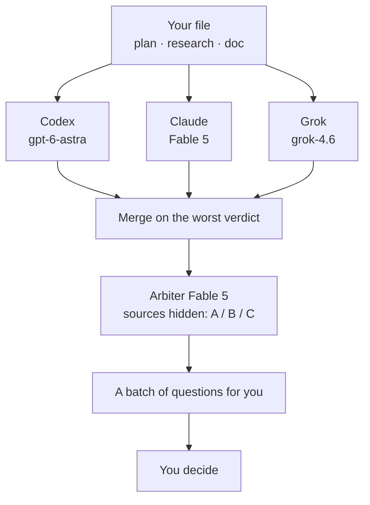

[Русский](README.md) · English

# Tier 2 — keys and your first plan check

This is where every key in the stack gets set up, and where you make your first `verif` run — one file read by three AIs from three different companies.

## Why

The costly mistake is not the one you missed. It is the one you argued yourself into.

Ask a single chat to "critique my plan" and it sees both the plan and your reasoning — so it completes your logic instead of breaking it: it agrees and reinforces. `verif` works the other way round: the same file is read by three AIs from three different vendors, separately, knowing neither the author nor the author's explanations.

Five steps of the mechanism:

1. Three readings in isolation — each has its own search, none sees the others' conclusions.
2. One answer format — the verdicts are comparable.
3. The worst branch wins, not the average: one "unreliable" makes the whole verdict unreliable.
4. A blind judge: the arbiter rules on findings without knowing whose each one is (labels A / B / C).
5. A batch of questions back to you — a human decides, not the pipeline.

## What it looks like


One run, end to end (tag `jadlis-verif--v2.0.0`):



<details>
<summary>Synthetic verdict sample (invented data)</summary>

```
Short version: needs revision — 9 raw findings from 3 checkers, 3 of them serious.
1. The plan assumes the service has a free tier — the pricing page has none.
2. Step 4 writes to a shared settings file directly; a parallel session would overwrite it.
3. There is no "what if the key is missing" branch — step 6 dies with a cryptic error instead of skipping.

VERDICT: NEEDS-REVISION  (Codex: needs-revision · Fable: needs-revision · Grok: approve)

FINDINGS (9):
  [HIGH]   Service has no free tier            (factual, verifiable)  — plan.md:41
  [HIGH]   Race on the shared config write     (risk, reasoning)      — plan.md:88
  [MEDIUM] Empty key is not handled            (risk, reasoning)      — plan.md:120
  [LOW]    Docs link returns 404               (factual, verifiable)  — plan.md:12

Arbiter: 6 apply · 2 skip (1 refuted by counter-evidence) · 1 discuss
Artifacts: AI/verif/2026-09-06--plan--{codex,fable,grok,merged,arbiter}.json
```

</details>

## Install

Paste the block below into Claude Code — it does the work.

```text
You are an installer. Do exactly these steps and nothing beyond them:
1. Bash: claude plugin marketplace add https://github.com/beCyborg/jadlis-hub
2. Bash: claude plugin install jadlis-search@jadlis --config BRAVE_API_KEY=<my Brave key> --config FIRECRAWL_API_KEY=<my Firecrawl key>
3. Bash: claude plugin install jadlis-verif@jadlis
4. Tell me: "Both plugins are in, the keys went into the macOS Keychain. Restart Claude Code
   fully — not /reload-plugins, jadlis-search ships its own MCP servers — and run /jadlis-search:keys."
```

The same path by hand, same commands:

1. **Get the two required keys.** Brave — https://api-dashboard.search.brave.com, the **Search** plan is the one you need. Firecrawl — https://firecrawl.dev/app/api-keys, a key shaped like `fc-…`.
2. **Add the marketplace and install `jadlis-search`.** `claude plugin marketplace add https://github.com/beCyborg/jadlis-hub`, then `claude plugin install jadlis-search@jadlis --config BRAVE_API_KEY=… --config FIRECRAWL_API_KEY=…`. The keys go into the Keychain, never into files; to change them later — `/plugin configure jadlis-search@jadlis`.
3. **Install `jadlis-verif`:** `claude plugin install jadlis-verif@jadlis`.
4. **Restart Claude Code fully.** `jadlis-search` ships MCP servers, and those start with the session; `/reload-plugins` does not apply to such plugins.
5. **Run `/jadlis-search:keys`.** The skill shows what is already there and takes the rest. If you only want `jadlis-verif`, skip the science keys — they belong to tier 3.

Your first run, on a file of your own:

```text
/verif --file <path to your plan>
```

No plan at hand — any draft decision will do. A synthetic snippet to try it on:

```text
Plan: move the newsletter to our own domain.
Assumptions: the provider has a free tier up to 10,000 emails; the move does not break old links.
Steps: 1) buy the domain, 2) migrate the list, 3) shut the old service down the same day.
```

Optional, but it changes the result noticeably:

- **Codex CLI** (ChatGPT subscription) — the first branch. Without it two remain: Claude and Grok.
- **Grok CLI** (Grok subscription) — the third branch, $0 on top of the subscription. Without it the run goes dual; in tier 3 you also lose the `grokweb` and `twitter` channels.

Missing both CLIs does not break the run: one Claude branch is left, but the whole point — independence of the readings — is gone. Read a single-branch verdict as an opinion, not as a check.

## Usage

Three scenarios, three commands:

```text
/verif --file Plan.md                    # full run: three branches → arbiter → questions
/verif --file Research.md --report-only  # report only, no questions, no edits
/verif --file Doc.md --only fable        # a single branch: a quick rough pass
```

Worth knowing as it runs:

- Branches run in parallel and report as they finish — the first verdict lands before the others.
- The file type (`plan` / `research` / `doc`) is detected automatically; `--type` sets it explicitly.
- Every artifact lands in the vault under `AI/verif/` — one json per branch, the merged verdict, the decisions file.
- Quality depends on what you hand over: an assumption written out is a target; an assumption dissolved into prose is a mine nobody finds.

## Limits and cost

What `verif` does not do:

- It does not review code or diffs — that is `/code-review`.
- It does not research a topic from scratch — that is tier 3 (`jadlis-research`, `jadlis-science-research`).
- It does not check a single phrase or date: thirty seconds of ordinary search is cheaper.
- It does not decide anything: it brings findings, you answer the questions.

What costs money:

| What | How much | Required |
|---|---|---|
| Brave Search API, Search plan | ≈$0.005 per request | yes |
| Firecrawl | per plan credits | yes |
| ChatGPT subscription (Codex CLI) | per subscription tier | no — the Codex branch |
| Grok subscription (Grok CLI) | $0 on top of the subscription | no — the Grok branch |

No branch may run longer than 600,000 ms — after that the timeout cuts it off and the verdict is assembled from the survivors. A silent branch is marked as a failure, never as agreement.

## Where the keys live

One principle: **a key is entered once and lives in the macOS Keychain, not in files.** Two classes:

| Class | Examples | Where it lives | Who writes it |
|---|---|---|---|
| A — keys of the plugin's MCP servers | `BRAVE_API_KEY`, `FIRECRAWL_API_KEY`, `REDDITAPIS_KEY`, `YOUTUBE_API_KEY` | Keychain, the Claude Code item `Claude Code-credentials` → `pluginSecrets` | Claude Code: `/plugin configure jadlis-search@jadlis` or `claude plugin install jadlis-search@jadlis --config KEY=…` |
| B — keys of scripts and `curl` blocks | science sources, Exa, Yandex, Places, contact emails | Keychain, a plain generic item: service `jadlis`, account = the key name | the `/jadlis-search:keys` skill — the value arrives on stdin, never on the command line |

One entry point reads them all: `scripts/secret.sh` inside the `jadlis-search` plugin. Resolution order:

1. The environment variable `$KEY`, if set.
2. Keychain generic item: service `jadlis`, account `KEY` (items under the old `jadlis-research` service are still read).
3. `pluginSecrets` from the `Claude Code-credentials` item (then `Claude Code-credentials-*` when there are several profiles).
4. `.credentials.json` in the settings directory — for platforms without a keychain.
5. `settings.json → env` — the legacy rail; the `keys` skill offers to retire it and delete the values from the file.

Nothing found — the script fails quietly and the channel or layer degrades. It never prints a key: only names, lengths and the source.

> [!note] The "security wants to access" prompt
> The first time `security` reads the `Claude Code-credentials` item, macOS may ask for permission — choose **Always Allow**. Otherwise class A keys stay visible to MCP servers but not to Bash scripts. Class B items are created so that no prompt appears.

Why not otherwise: `settings.json` is plain text with mode 644 and ends up in backups; the desktop Claude Code does not read a shell profile (`~/.zshenv`) for MCP servers; subscription password managers are not available to everyone. The Keychain is there for everyone and shared across tools.

Next — [tier 3: research](https://github.com/beCyborg/jadlis-hub/blob/main/docs/3-research/README.md).
